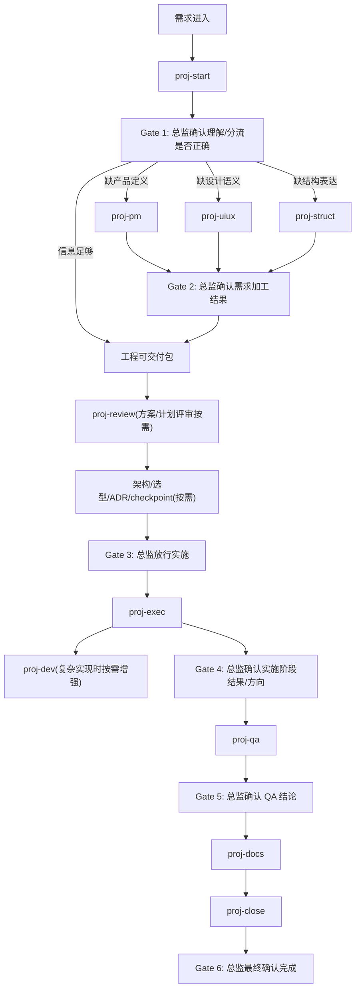

# AI 团队工作流模型 v1

> 状态：Draft v1  
> 作用：从“总监 + 多角色 agent”视角定义完整主流程、角色分工、skill 映射与审核门禁。  
> 定位：共享规则层，作为 `task-decomposition-protocol-v1.md` 的上位流程补充文档。

---

## 1. 适用目的

本文件用于回答以下问题：

- 整个 AI 团队的主流程如何串起来；
- 传统角色分工如何映射到现有 skills；
- 哪些是主链 skill，哪些是增强角色，哪些只是支撑能力；
- 哪些节点必须由总监（用户）审核拍板；
- “可交付”与“已放行”之间的区别如何落到工作流中。

本文件不替代：
- `task-decomposition-protocol-v1.md` 的拆分语义规则；
- `spec / plan / task` 模板；
- `proj-start / proj-exec / proj-qa / proj-close` 的具体技能说明。

---

## 2. 核心总原则

### 2.1 总监视角

用户在本体系中的角色是：

> **团队总监 / 最终审批人**

总监负责：
- 审核每阶段产物；
- 决定是否进入下一阶段；
- 决定是否放行进入实施；
- 决定是否通过 QA 并进入归档/提交；
- 决定任务是否最终完成。

### 2.2 统一入口原则

所有需求统一从 `proj-start` 进入。

`proj-pm`、`proj-uiux`、`proj-dev`、`proj-review` 不作为默认独立入口，而是在对应缺口、复杂场景或开发前评审需要下按需参与。

### 2.3 放行门禁原则

> **可交付不等于已放行。**

agent 可以给出“当前已可交付”的建议，
但是否进入 `proj-exec`，最终必须由总监明确许可。

### 2.4 技术角色收敛原则

技术实施角色统一按 **高级工程师** 标准定义，不再区分普通开发工程师与高级工程师。

当前技术线核心角色只有两个：
- **架构师**：负责关键技术决策与边界；
- **高级工程师**：负责真正实施。

---

## 3. 三层结构

### 3.1 主链

主链 skill 固定为：

- `proj-start`
- `proj-exec`
- `proj-qa`
- `proj-docs`
- `proj-close`

这些构成唯一主流程。

### 3.2 增强角色

增强角色按需参与，不抢主入口：

- `proj-pm`
- `proj-uiux`
- `proj-dev`
- `proj-review`

### 3.3 支撑能力

这些不是传统岗位角色，而是通用能力：

- `proj-struct`
- `proj-adr`
- `proj-checkpoint`
- `consult`（多智能体讨论能力层）
- `cross-review`（跨模型只读复核，消费 consult）
- `figma`
- `playwright`
- `draw`
- `tapd-workflow`
- `ui_ux_pro_max`
- `memory-sync`

---

## 4. 角色与 skill 映射

| 角色 | 是否主链 | 对应 skill | 主要职责 | 主要产物 | 是否需总监审核 |
|---|---|---|---|---|---|
| 总监 | - | 用户本人 | 最终决策、放行、验收 | 审核结论 | 必须 |
| 项目编排 / PMO | 主链 | `proj-start` | 统一入口、理解回述、分级、缺口识别、分流、形成工程可交付包 | 启动结论、缺口判断、交付建议 | 必须 |
| 产品经理 | 增强 | `proj-pm` | 需求澄清、MVP、范围、目标、success metric | PRD / spec 输入 | 必须 |
| 方案评审 | 增强 | `proj-review` | PRD、MVP、技术方案、验收标准、风险与 Ready for Dev 评审 | 方案评审结论、风险登记、放行建议 | 必须 |
| UI/UX 设计师 | 增强 | `proj-uiux` | 设计语义、交互状态、视觉约束 | 设计语义说明、状态说明 | 必须 |
| 架构师 | 组合角色 | `proj-start` + `proj-adr` + `proj-checkpoint` + `proj-struct` | 技术选型、边界、关键决策、ADR | 架构决策、ADR、结构图 | 必须 |
| 高级工程师 | 主链 | `proj-exec` | 默认实施主入口，代码落地、文档更新、验证证据 | 改动结果、task 更新、验证证据 | 关键节点必须 |
| 高级工程师增强 | 增强 | `proj-dev` | 复杂实现策略、局部架构、质量增强 | 实现增强方案、复杂改动结果 | 按需 |
| QA 主入口 | 主链 | `proj-qa` | 验证、code review、安全检查、黑盒验证、Playwright、QA 结论 | QA 结论、复现证据 | 必须 |
| 文档 / 发布管理员 | 主链 | `proj-docs` / `proj-close` | 归档、changelog、commit、收尾 | 归档文档、提交准备 | 必须 |

---

## 5. 各角色边界规则

### 5.1 `proj-start`

- 唯一默认入口；
- 负责理解回述、分级、缺口识别、分流建议；
- 负责形成“工程可交付包”；
- 不直接替代产品、UI/UX、实施、QA；
- 不得绕过总监放行门禁。

### 5.2 `proj-pm`

- 负责“定义做什么”；
- 只在产品定义缺口明显时介入；
- 默认输出并入 `spec`；
- 不负责工程启动与实施。

### 5.3 `proj-uiux`

- 负责“界面和交互必须呈现什么语义”；
- 只在设计语义、状态定义、视觉强约束不清时介入；
- 默认输出并入 `spec / plan`；
- 不负责产品边界与最终代码实施。

### 5.4 架构师（组合承担）

- 负责关键技术选型与边界决策；
- 负责新依赖、协议、路由、状态模型等重大技术问题；
- 必要时触发 `proj-adr` 与 `proj-checkpoint`；
- 当前无单独架构师 skill，由多 skill 组合承担；
- 所有关键架构决策必须经过总监审核。

### 5.5 `proj-exec`

- 高级工程师默认实施主入口；
- 负责真正实施、更新 task / worklog、控制范围、产出验证证据；
- 复杂实现时才调用 `proj-dev`；
- 不替代放行前架构决策。

### 5.6 `proj-dev`

- 高级工程师增强模式；
- 负责复杂实现策略、局部代码架构、重构抽象质量、测试策略增强；
- 不作为并行主线；
- 不负责放行前关键决策。

### 5.7 `proj-qa`

- 默认 QA 主入口；
- 负责 verify / code review / security 与最终 QA 结论；
- 当常规验证不足以放行时，直接承担黑盒验证、Playwright、测试细图与边界异常流增强；
- 不修代码。

### 5.8 `proj-review`

- 开发前方案评审入口；
- 负责 PRD、MVP、技术方案、验收标准、风险与 Ready for Dev 评审；
- 不跑实现后测试，不替代 `proj-qa`；
- 发现架构决策缺口时转交 `proj-adr`。

### 5.9 `proj-docs` / `proj-close`

- `proj-docs` 负责文档生命周期与归档收敛；
- `proj-close` 负责提交、收尾、最终整理；
- 文档应先由 `proj-docs` 收敛，再进入 `proj-close`；
- 两者都不应替代 QA 或实施阶段工作。

### 5.10 `proj-adr` / `proj-checkpoint`

- `proj-adr` 属于架构治理节点，用于记录关键决策并服务于总监的架构放行；
- `proj-checkpoint` 属于高风险基线节点，用于在关键改动前后提供可回溯锚点；
- 两者都不是默认主链入口，而是在命中架构级问题或高风险场景时按需进入。

### 5.11 `ui_ux_pro_max` / `figma` / `playwright` / `draw`

- `ui_ux_pro_max` 属于 UI/UX 参考能力库，用于补充风格、排版、配色、无障碍等启发，不替代 `proj-uiux`；
- `figma` 属于设计上下文读取能力，用于获取真实设计节点、截图、变量与资产；
- `playwright` 属于自动化验证能力，通常服务于 `proj-qa`；
- `draw` 属于白板落地能力，用于把结构表达落成可编辑 Excalidraw 文件。

---

## 6. 完整主流程



---

## 7. 各 Gate 含义

### Gate 1：启动确认
确认：
- 理解是否正确；
- 分级是否合理；
- 缺口识别与分流建议是否合理。

### Gate 2：需求加工确认
确认：
- PRD / spec 是否足够清楚；
- 设计语义是否足够；
- 结构表达是否足够；
- 是否形成工程可交付包。

### Gate 3：实施放行
确认：
- 架构/选型与风险是否可接受；
- 是否允许进入代码实施阶段。

### Gate 4：实施中途确认
确认：
- 实现方向是否没偏；
- 是否需要继续、重切、checkpoint 或增强。

### Gate 5：QA 放行
确认：
- 当前质量是否足够；
- 是否允许进入归档与提交阶段。

### Gate 6：最终完成
确认：
- 文档、归档、提交是否都已妥当；
- 任务是否真正可以结束。

---

## 8. 三种最小可跑路径

### 8.1 简单任务

```text
proj-start -> Gate 1 -> proj-exec -> proj-qa -> Gate 5 -> proj-close
```

适用于：
- L0
- 轻量 L1

### 8.2 常规任务

```text
proj-start -> proj-pm / proj-uiux（按需） -> Gate 2 -> proj-exec -> proj-qa -> proj-docs -> proj-close
```

适用于：
- 一般 L1

### 8.3 复杂任务

```text
proj-start -> proj-pm -> proj-struct -> proj-uiux -> proj-review -> 架构决策 / ADR / checkpoint -> Gate 3 -> proj-exec -> proj-dev -> proj-qa -> proj-docs -> proj-close
```

适用于：
- L2
- 架构、迁移、核心链路任务

---

## 9. 与拆分协议的关系

本文件回答：
- 谁负责什么；
- 流程怎么走；
- 哪些 Gate 需要总监审核。

`task-decomposition-protocol-v1.md` 回答：
- 任务怎么拆；
- `Mission / Scope / Slice` 怎么定义；
- `Gap Check / Reslice / 结构总图 / 测试细图` 怎么用。

一句话：

```text
workflow model = 角色 + 流程 + Gate
protocol = 拆分 + 文档 + 验证规则
```

---

## 10. 已废弃框架

### CCB / AutoFlow 框架（已废弃）

以下组件已废弃，不再作为推荐入口：

- `/tp`（AutoFlow 计划）→ 使用 `proj-start`
- `/tr`（AutoFlow 步骤执行）→ 使用 `proj-exec`
- `ask` / `pend` / `cping` / `ccb boot`（tmux 多 provider 管理）→ 使用 `consult`
- `autoloop`（tmux 自动推进）→ 已删除

多模型协作的唯一推荐方式：
- 单方复核 → `cross-review`（内部调用 `codex exec`）
- 多方讨论 → `consult`（调用 `codex exec` + `claude -p`）

---

## 11. 当前仍待补充的点

以下主题值得后续继续正式化：

1. 架构师角色的独立规则文件；
2. 架构决策阶段的详细门禁与产物定义；
3. 角色 / skill / Gate 总表是否拆成单独索引文件；
4. 支撑能力层（如 `proj-struct`、`figma`、`playwright`、`consult`）的统一调用规则。
